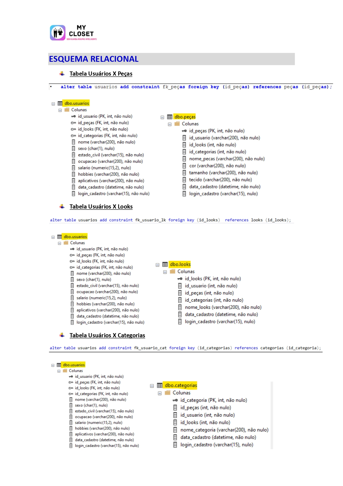
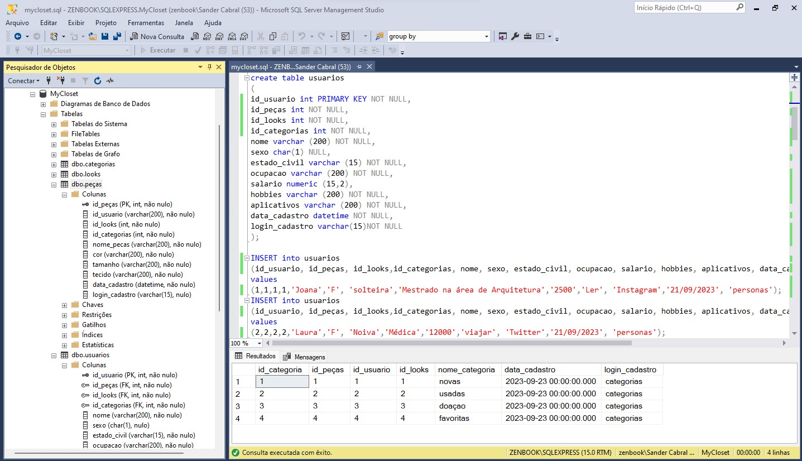
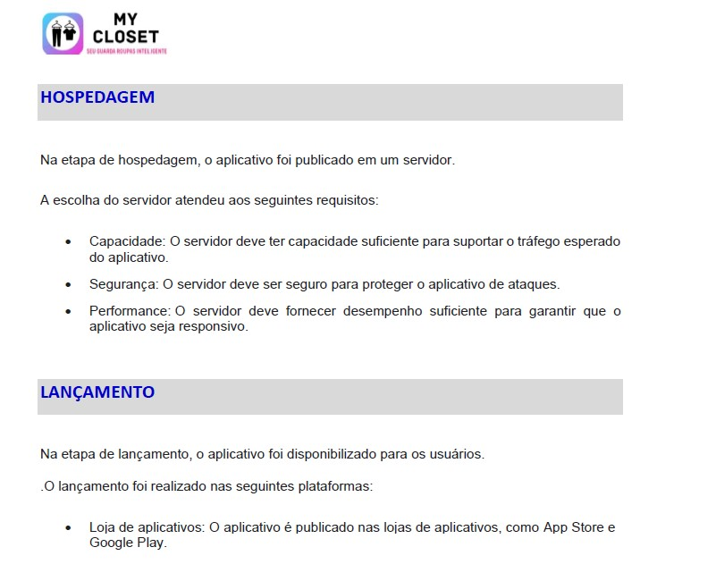

# Arquitetura da Solução

Pré-requisitos: <a href="3-Projeto de Interface.md"> Projeto de Interface</a>

Definição de como o software é estruturado em termos dos componentes que fazem parte da solução e do ambiente de hospedagem da aplicação.

## Diagrama de Classes

O diagrama de classes ilustra graficamente como será a estrutura do software, e como cada uma das classes da sua estrutura estarão interligadas. Essas classes servem de modelo para materializar os objetos que executarão na memória.

## Modelo ER

Um diagrama de entidade-relacionamento (DER) é uma representação visual que descreve a estrutura de um sistema de banco de dados ou as relações entre entidades (tabelas) dentro desse sistema. Ele usa símbolos gráficos para representar entidades, atributos e os relacionamentos entre entidades. O principal objetivo de um DER é modelar como os dados são organizados e inter-relacionados em um banco de dados, proporcionando uma visão clara das entidades envolvidas e suas conexões.  É amplamente utilizado em engenharia de software e gerenciamento de banco de dados para planejar, projetar e documentar sistemas de informações complexos.

## Esquema Relacional

O Esquema Relacional corresponde à representação dos dados em tabelas juntamente com as restrições de integridade e chave primária.

 
## Modelo Físico

Entregar um arquivo banco.sql contendo os scripts de criação das tabelas do banco de dados. Este arquivo deverá ser incluído dentro da pasta src\bd.

* scrip anexado (pasta src\bd) - src/assets/mycloset.sql
  
## Tecnologias Utilizadas

Descreva aqui qual(is) tecnologias você vai usar para resolver o seu problema, ou seja, implementar a sua solução. Liste todas as tecnologias envolvidas, linguagens a serem utilizadas, serviços web, frameworks, bibliotecas, IDEs de desenvolvimento, e ferramentas.

Apresente também uma figura explicando como as tecnologias estão relacionadas ou como uma interação do usuário com o sistema vai ser conduzida, por onde ela passa até retornar uma resposta ao usuário.

## Hospedagem

Explique como a hospedagem e o lançamento da plataforma foi feita.

> **Links Úteis**:
>
> - [Website com GitHub Pages](https://pages.github.com/)
> - [Programação colaborativa com Repl.it](https://repl.it/)
> - [Getting Started with Heroku](https://devcenter.heroku.com/start)
> - [Publicando Seu Site No Heroku](http://pythonclub.com.br/publicando-seu-hello-world-no-heroku.html)

## Qualidade de Software

A norma ISO 9126 é uma norma internacional que define um conjunto de características e subcaracterísticas para a avaliação da qualidade de software.  A escolha específica de características e subcaracterísticas dependerá das necessidades e objetivos do projeto de software.

